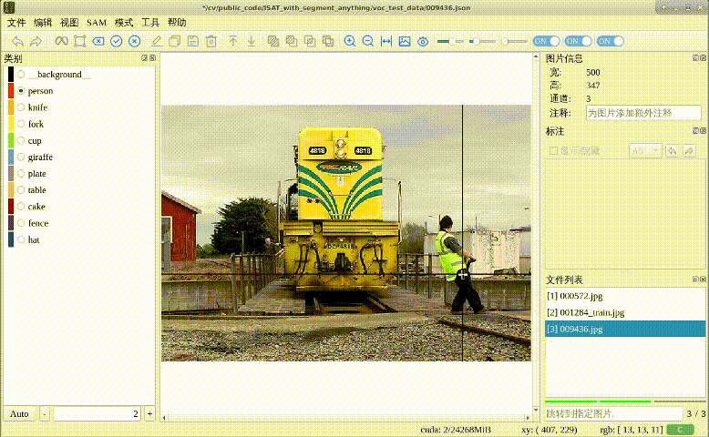
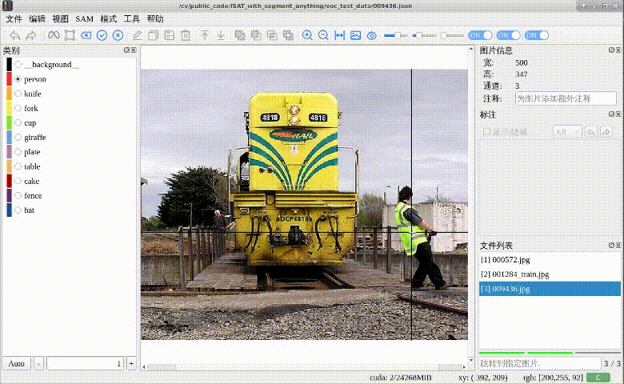
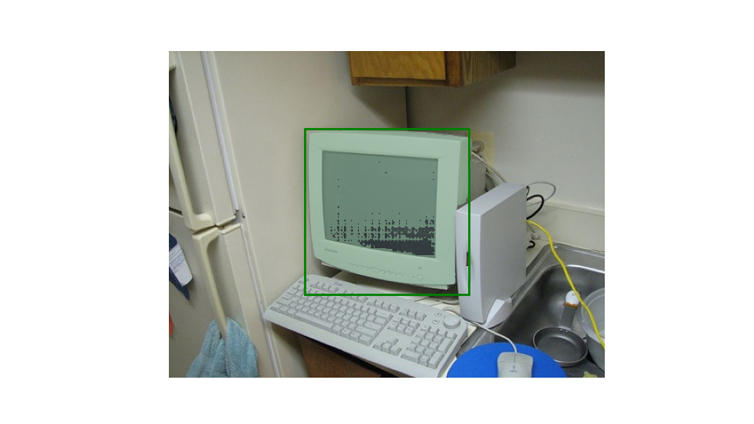
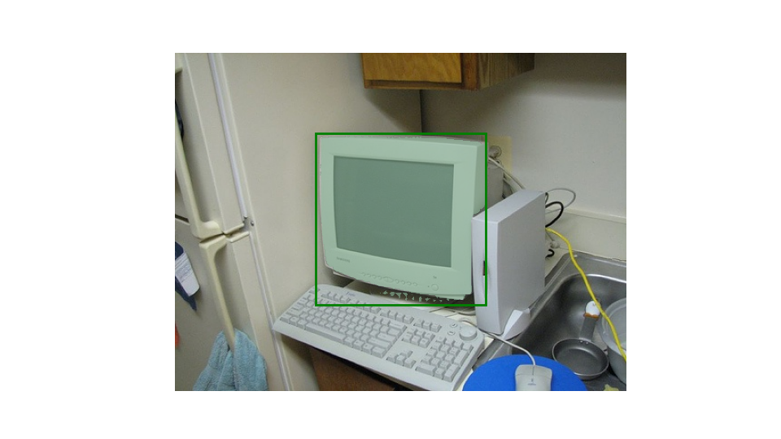

# Segment-anything学习到微调系列3_SAM微调decoder

## 前言

此前讲过，以ViT_B为基础的SAM权重是375M，其中prompt encoder只有32.8k，mask decoder是16.3M(4.35%)，剩余则是image encoder，image encoder是非常大的，一般不对它进行微调，预训练的已经够好了，除非是类似医疗影像这种非常规数据，预训练数据中没有，效果会比较差，才会对image encoder也进行微调，所以此处只针对decoder进行微调。


## 微调效果

### 基于point prompt

这部分是只针对point作为提示的微调，借助了[ISAT_with_segment_anything](https://github.com/yatengLG/ISAT_with_segment_anything)这个用SAM做自动标注的工具来进行一个效果比对，可以看出来微调前，需要点击多次多个点才能分割得较好，微调后点击一下就能分割出对应类别

**微调前**



**微调后**



### 基于box prompt

这部分加入了box作为提示的微调

**微调前**



**微调后**



## 快速入手

### 环境安装

需要 python>=3.8, as well as pytorch>=1.7 and torchvision>=0.8. 装好和自己CUDA版本匹配的pytorch和torchvision基本就能用了

**A Python-3.9 virtual environment using conda is recommended**

```
conda create --name finetuneSAM python=3.9
conda activate finetuneSAM 
git clone https://github.com/xzyun2011/finetune_segment_anything_tutorial.git
cd finetune_segment_anything_tutorial
pip install -r requirements.txt
```


**:exclamation::exclamation::exclamation:CUDA 版本比较低的，推荐这样安装**

```
conda create --name finetuneSAM python=3.8
conda activate finetuneSAM 
conda install pytorch==1.12.1 torchvision==0.13.1 torchaudio==0.12.1 cudatoolkit=11.3 -c pytorch
git clone https://github.com/xzyun2011/finetune_segment_anything_tutorial.git
cd finetune_segment_anything_tutorial
```

### 代码使用

#### Fine-tuning

* **Step 0**, 下载SAM的权重，可以从segment-anything github repo [model checkpoint](https://github.com/facebookresearch/segment-anything#model-checkpoints) 直接下载

* **Step 1**, 准备好VOC2007 dataset,直接 [官网](http://host.robots.ox.ac.uk/pascal/VOC/voc2007/) 或者百度网盘(Link: https://pan.baidu.com/s/1vkk3lMheUm6IjTXznlg7Ng    Password: 44mk)

  代码里面有个迷你版的VOC2007数据集，在 “data_example”里面，下好了权重可以直接用这个目录文件试跑

* **Step 2**, 开始 fine-tuning

  :exclamation: **记得把模型、数据路径换成自己的，gpu id也可以指定** :exclamation: 

  ```
  python3 finetune_sam_voc.py --w weights/sam_vit_b_01ec64.pth --type vit_b --data data_example/VOCdevkit
  ```


#### Show result 

用下面的命令加载微调后的decoder，并基于Box prompt的方式推理图片

```
python3 predict_show.py --w weights/sam_vit_b_01ec64.pth  --type vit_b --decoder weights/sam_decoder_finetune_pointbox.pth  --data data_example/VOCdevkit
```

基于Voc2007 train_val中420多张图片进行微调的decoder，有纯point prompt 和 point box prompt两个，在百度网盘中(Link: https://pan.baidu.com/s/1sDQu5Oth4FqNYbIY2qreKw  Password: 36ou)


## 代码讲解

### 数据读取

使用的是VOC2007分割数据集，总共632张图片（412train_val，210test），一共20个类别，加上背景类一共21，标签是png格式，像素值代表物体类别，同时所有物体mask的外轮廓值是255，训练时会忽略，原始数据集如下目录构造（github上的代码中data_example只是示例，只有几张图），训练使用的是SegmentationObject中的标签：

```
## VOCdevkit/VOC2007
├── Annotations
├── ImageSets
│   ├── Layout
│   ├── Main
│   └── Segmentation
├── JPEGImages
├── SegmentationClass
└── SegmentationObject
```

CustomDataset的代码按如上目录结构读取对应数据，根据ImageSets/Segmentation目录下的txt_name指定训练的文件名字，然后读取对应图片和标签，有以下几点注意：

* 分割标签使用PIL读取，像素值就是对应类别，255是外轮廓会忽略；如果使用opencv读取图片，需要根据RGB值去platte表中看对应类别
* image和gt都是按numpy array塞进batch中，后面丢给sam会转为tensor；**voc2007中每张图片大小是不一致的，目前就按batch=1处理**
* gt的channel是1，后面需要转为one-hot的形式

```
class CustomDataset(Dataset):
    def __init__(self, VOCdevkit_path, txt_name="train.txt", transform=None):
        self.VOCdevkit_path = VOCdevkit_path
        with open(os.path.join(VOCdevkit_path, f"VOC2007/ImageSets/Segmentation/{txt_name}"), "r") as f:
            file_names = f.readlines()
        self.file_names = [name.strip() for name in file_names]
        self.image_dir = os.path.join(self.VOCdevkit_path, "VOC2007/JPEGImages")
        self.image_files = [f"{self.image_dir}/{name}.jpg" for name in self.file_names]
        self.gt_dir = os.path.join(self.VOCdevkit_path, "VOC2007/SegmentationObject")
        self.gt_files = [f"{self.gt_dir}/{name}.png" for name in self.file_names]

    def __len__(self):
        return len(self.file_names)

    def __getitem__(self, idx):
        image_path = self.image_files[idx]
        image_name = image_path.split("/")[-1]
        gt_path = self.gt_files[idx]

        image = cv2.imread(image_path)
        image = image[..., ::-1] ## RGB to BGR
        image = np.ascontiguousarray(image)
        gt = Image.open(gt_path)
        gt = np.array(gt, dtype='uint8')
        gt = np.ascontiguousarray(gt)

        return image, gt, image_name

    @staticmethod
    def custom_collate(batch):
        """ DataLoader中collate_fn,
         图像和gt都用numpy格式，后面会重新转tensor
        """
        images = []
        seg_labels = []
        images_name = []
        for image, gt, image_name in batch:
            images.append(image)
            seg_labels.append(gt)
            images_name.append(image_name)
        images = np.array(images)
        seg_labels = np.array(seg_labels)
        return images, seg_labels, images_name
```

### 图像预处理

取得图像后，直接使用SamPredictor中的预处理方式，会将图片按最长边resized到1024x1024，然后计算image_embedding，这部分很耗时，所以每张图只计算一次，会将结果缓存起来需要的时候直接调用。使用"with torch.no_grad()"保证image encoder部分不需要梯度更新，冻结对应权重

```
    model_transform = ResizeLongestSide(sam.image_encoder.img_size)
    for epoch in range(num_epochs):
        epoch_loss = 0
        for idx, (images, gts, image_names) in enumerate(tqdm(dataloader)):
            valid_classes = []  ## voc 0,255 are ignored
            for i in range(images.shape[0]):
                image = images[i] # h,w,c np.uint8 rgb
                original_size = image.shape[:2] ## h,w
                input_size = model_transform.get_preprocess_shape(image.shape[0], image.shape[1],
                                                                  sam.image_encoder.img_size)  ##h,w
                gt = gts[i].copy() #h,w labels [0,1,2,..., classes-1]
                gt_classes = np.unique(gt)  ##masks classes: [0, 1, 2, 3, 4, 7]
                image_name = image_names[i]

                predictions = []
                ## freeze image encoder
                with torch.no_grad():
                    # gt_channel = gt[:, :, cls]
                    predictor.set_image(image, "RGB")
                    image_embedding = predictor.get_image_embedding()
```

### Prompt生成

从mask中随机选取一定数量的前景点和背景点，此处默认1个前景点和1个背景点，数量多的话一般保持2:1的比例较好。

mask_value就是对应的类别id，去mask中找出像素值等于类别id的点坐标，然后随机选取点就行。此处还会根据mask算外接矩形（实际上直接读取图片对应的xml标签文件也行），用于后续基于box prompt的finetune。

```
def get_random_prompts(mask, mask_value, foreground_nums=1, background_nums=1):
    # Find the indices (coordinates) of the foreground pixels
    foreground_indices = np.argwhere(mask == mask_value)
    ymin, xmin= foreground_indices.min(axis=0)
    ymax, xmax = foreground_indices.max(axis=0)
    bbox = np.array([xmin, ymin, xmax, ymax])
    if foreground_indices.shape[0] < foreground_nums:
        foreground_nums = foreground_indices.shape[0]
        background_nums = int(0.5 * foreground_indices.shape[0])
    background_indices = np.argwhere(mask != mask_value)

    ## random select
    foreground_points = foreground_indices[
        np.random.choice(foreground_indices.shape[0], foreground_nums, replace=False)]
    background_points = background_indices[
        np.random.choice(background_indices.shape[0], background_nums, replace=False)]

    ## 坐标点是(y,x)，输入给网络应该是(x,y),需要翻一下顺序
    foreground_points = foreground_points[:, ::-1]
    background_points = background_points[:, ::-1]

    return (foreground_points, background_points), bbox
```

得到的prompt是一些点的坐标，坐标的x,y是基于原图的，但进入SAM的图片会resized到1024x1024，所以点坐标也需要resize，对应如下代码

```
    all_points = np.concatenate((foreground_points, background_points), axis=0)
    all_points = np.array(all_points)
    point_labels = np.array([1] * foreground_points.shape[0] + [0] * background_points.shape[0], dtype=int)
    ## image resized to 1024, points also
    all_points = model_transform.apply_coords(all_points, original_size)

    all_points = torch.as_tensor(all_points, dtype=torch.float, device=device)
    point_labels = torch.as_tensor(point_labels, dtype=torch.float, device=device)
    all_points, point_labels = all_points[None, :, :], point_labels[None, :]
    points = (all_points, point_labels)

    if not box_prompt:
        box_torch=None
    else:
        ## preprocess bbox
        box = model_transform.apply_boxes(bbox, original_size)
        box_torch = torch.as_tensor(box, dtype=torch.float, device=device)
        box_torch = box_torch[None, :]
```

微调代码中可以指定基于哪种prompt进行微调，如果是point和box同时都开，会按一定概率舍弃point或box以取得更好的泛化性（不然推理时只有point或只有box作为prompt效果可能不太好）。最后经过prompt_encoder得到sparse_embeddings, dense_embeddings。

```
    ## if both, random drop one for better generalization ability
    if point_box and np.random.random()<0.5:
        if np.random.random()<0.25:
            points = None
        elif np.random.random()>0.75:
            box_torch = None
    ## freeze prompt encoder
    with torch.no_grad():
        sparse_embeddings, dense_embeddings = sam.prompt_encoder(
            points = points,
            boxes = box_torch,
            # masks=mask_predictions,
            masks=None,
        )
```

### Mask预测

mask decoder这部分不需要冻结，直接调用mask_decoder推理就行，这里进行了两次mask预测，第一次先预测3个层级的mask然后选出得分最高的一个，将这个mask作为一个mask prompt，并与point prompt、box_prompt一起丢进prompt_encoder得到新的sparse_embeddings, dense_embeddings，再进行第二次mask预测，这次只预测一个mask。相当于先得到粗糙的mask，然后再精修。最后经过后处理nms等得到和原图大小一样的预测mask，一个物体对应一张mask，将多个mask叠起来就得到这张图所有的预测结果predictions。

```python
    ## predicted masks, three level
    mask_predictions, scores = sam.mask_decoder(
        image_embeddings=image_embedding.to(device),
        image_pe=sam.prompt_encoder.get_dense_pe(),
        sparse_prompt_embeddings=sparse_embeddings,
        dense_prompt_embeddings=dense_embeddings,
        multimask_output=True,
    )
    # Choose the model's best mask
    mask_input = mask_predictions[:, torch.argmax(scores),...].unsqueeze(1)
    with torch.no_grad():
        sparse_embeddings, dense_embeddings = sam.prompt_encoder(
            points=points,
            boxes=box_torch,
            masks=mask_input,
        )
        ## predict a better mask, only one mask
        mask_predictions, scores = sam.mask_decoder(
            image_embeddings=image_embedding.to(device),
            image_pe=sam.prompt_encoder.get_dense_pe(),
            sparse_prompt_embeddings=sparse_embeddings,
            dense_prompt_embeddings=dense_embeddings,
            multimask_output=False,
        )
        best_mask = sam.postprocess_masks(mask_predictions, input_size, original_size)
        predictions.append(best_mask)
```

### Loss计算

**代码中loss用的是BCELoss加DiceLoss，需要gt和pred的shape一致，都为BxCxHxW的形式，pred是经过sigmoid后的值。**

因此需要将gt转为one-hot的形式，即将(batch_size, 1, h, w)转为(batch_size, c, h, w)，c是gt_classes中有的类别个数，即图片中有多少个实例类别。

```
def mask2one_hot(label, gt_classes):
    """
    label: 标签图像 # (batch_size, 1, h, w)
    num_classes: 分类类别数
    """
    current_label = label.squeeze(1) # （batch_size, 1, h, w) ---> （batch_size, h, w)
    batch_size, h, w = current_label.shape[0], current_label.shape[1], current_label.shape[2]
    one_hots = []
    for cls in gt_classes:
        if isinstance(cls, torch.Tensor):
            cls = cls.item()
        tmplate = torch.zeros(batch_size, h, w)  # （batch_size, h, w)
        tmplate[current_label == cls] = 1
        tmplate = tmplate.view(batch_size, 1, h, w)  # （batch_size, h, w) --> （batch_size, 1, h, w)
        one_hots.append(tmplate)
    onehot = torch.cat(one_hots, dim=1)
    return onehot
```

另外BCE接受的pred值是logit形式，所以需要将predictions用sigmoid处理，后续loss计算对应如下代码

```
    gts = torch.from_numpy(gts).unsqueeze(1) ## BxHxW ---> Bx1xHxW
    gts_onehot = mask2one_hot(gts, valid_classes)
    gts_onehot = gts_onehot.to(device)

    predictions = torch.sigmoid(predictions)
    # #loss = seg_loss(predictions, gts_onehot)
    loss = BCEseg(predictions, gts_onehot)
    loss_dice = soft_dice_loss(predictions, gts_onehot, smooth = 1e-5, activation='none')
    loss = loss + loss_dice
```

### 权重保存

optimizer默认是AdamW，scheduler是CosineAnnealingLR，这些可以自己修改。最后保存的权重只保存当前loss最小的，而且只保存decoder部分的权重，可以按需修改

```python
if epoch_loss < best_loss:
    best_loss = epoch_loss
    mask_decoder_weighs = sam.mask_decoder.state_dict()
    mask_decoder_weighs = {f"mask_decoder.{k}": v for k,v in mask_decoder_weighs.items() }
    torch.save(mask_decoder_weighs, os.path.join(save_dir, f'sam_decoder_fintune_{str(epoch+1)}_pointbox_monai.pth'))
    print("Saving weights, epoch: ", epoch+1)
```


## 致谢

* [segment-anything](https://github.com/facebookresearch/segment-anything)
* [ISAT_with_segment_anything](https://github.com/yatengLG/ISAT_with_segment_anything)