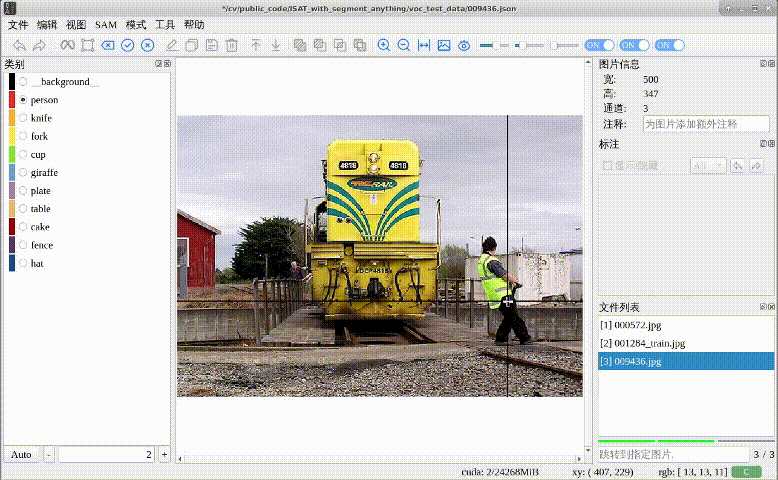

# Finetune_segment_anything_tutorial

This is a tutorial of fine-tuning segment anything based on VOC2007 dataset

[English](README.md) | [简体中文](README-cn.md)

## Main Results

### Point prompt

Fine-tuning specifically for point prompts. Used [ISAT_with_segment_anything](https://github.com/yatengLG/ISAT_with_segment_anything) tool, which uses SAM for automatic annotation, to compare results. 

Before fine-tuning, multiple clicks on several points were needed for good segmentation. 

After fine-tuning, a single click can segment the corresponding category effectively. 

**Before fine-tuning**



**After fine-tuning**


### Box prompt

Fine-tuning for point prompts and box prompts.


## Getting Started

### Installation

The code requires python>=3.8, as well as pytorch>=1.7 and torchvision>=0.8. Please follow the instructions [here](https://pytorch.org/get-started/locally/) to install both PyTorch and TorchVision dependencies. Installing both PyTorch and TorchVision with CUDA support is strongly recommended.


**A Python-3.9 virtual environment using conda is recommended**

```
conda create --name finetuneSAM python=3.9
conda activate finetuneSAM 
git clone https://github.com/xzyun2011/finetune_segment_anything_tutorial.git
cd finetune_segment_anything_tutorial
pip install -r requirements.txt
```


:exclamation::exclamation::exclamation:If your CUDA version is **below 11.7**, use the following command to install torch environment 

```
conda create --name finetuneSAM python=3.8
conda activate finetuneSAM 
conda install pytorch==1.12.1 torchvision==0.13.1 torchaudio==0.12.1 cudatoolkit=11.3 -c pytorch
git clone https://github.com/xzyun2011/finetune_segment_anything_tutorial.git
cd finetune_segment_anything_tutorial
```


### Usage

#### Fine-tuning

* **Step 0**, download a [model checkpoint](https://github.com/facebookresearch/segment-anything#model-checkpoints) from segment-anything github repo. 

* **Step 1**, prepare VOC2007 dataset, you can download from [the official website](http://host.robots.ox.ac.uk/pascal/VOC/voc2007/) or from BaiduNetdisk(Link: https://pan.baidu.com/s/1vkk3lMheUm6IjTXznlg7Ng    Password: 44mk)

  This repo provides a mini demo VOC2007 in “data_example”.

* **Step 2**, start fine-tuning

  :exclamation: **Note change to your own model and data path** :exclamation: 

  ```
  python3 finetune_sam_voc.py --w weights/sam_vit_b_01ec64.pth --type vit_b --data data_example/VOCdevkit
  ```


#### Show result 

You could load a finetuned decoder for inference using following command:

```
python3 predict_show.py --w weights/sam_vit_b_01ec64.pth  --type vit_b --decoder weights/sam_decoder_finetune_pointbox.pth  --data data_example/VOCdevkit
```

Some finetuned decoder(point prompt based and  point/box prompt based) could find in BaiduNetdisk(Link: https://pan.baidu.com/s/1sDQu5Oth4FqNYbIY2qreKw  Password: 36ou)


### A Chinese blog document

[Segment-anything学习到微调系列3_SAM微调decoder](https://blog.csdn.net/qq_37795208/article/details/140766645?spm=1001.2014.3001.5502)


## Acknowledgement

* [segment-anything](https://github.com/facebookresearch/segment-anything)
* [ISAT_with_segment_anything](https://github.com/yatengLG/ISAT_with_segment_anything)


## License

This project is released under the [MIT License](https://github.com/xzyun2011/finetune_segment_anything_tutorial/blob/main/LICENSE). Please also adhere to the Licenses of models and datasets being used.
